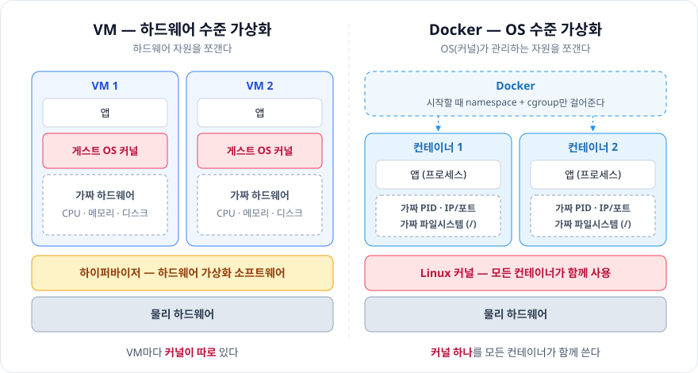
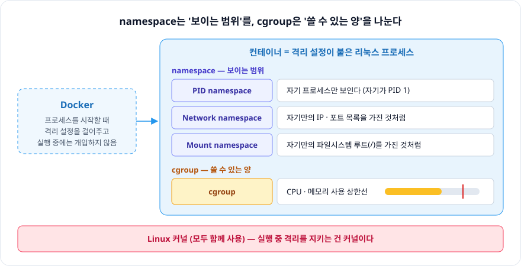

# 1장. 도커란 무엇인가?

> 도커는 **OS 수준 가상화**로 프로세스를 격리해서, 마치 독립된 리눅스 환경처럼 보이게 만든다.

 

## 가상화

**가상화**: 하나의 물리적 자원을 소프트웨어로 쪼개서, 여러 개의 독립된 것처럼 보이게 만드는 기술

무엇을 쪼개느냐에 따라 VM과 Docker로 나뉜다.

- **VM (하드웨어 수준 가상화)**: 하드웨어 자원을 쪼갠다.
  - 하이퍼바이저(하드웨어 가상화 소프트웨어)가 VM마다 가짜 CPU / 메모리 / 디스크를 만든다.
  - 그 위에서 VM마다 **커널이 따로** 돈다.
- **Docker (OS 수준 가상화)**: OS(커널)가 관리하는 자원을 쪼갠다.
  - 프로세스마다 가짜 IP / 포트, 파일시스템을 준다.
  - **커널은 모두 함께** 쓴다.

 

## Docker는 무엇을 하는가

Docker의 역할은 프로세스를 시작할 때 **namespace + cgroup**을 걸어서,
프로세스가 **마치 자기만의 독립된 리눅스 환경(OS)을 가진 것처럼** 보이게 하는 것이다.

- 실제로 OS 커널은 같이 쓴다.
- 실행 중(런타임)에는 Docker가 개입하지 않는다. 격리를 지키는 건 커널이다.

### namespace — 보이는 범위를 나눈다

| namespace | 격리 효과 |
|---|---|
| PID namespace | 자기 프로세스만 보이도록 |
| Network namespace | 자기만의 IP, 포트 목록을 가진 것처럼 |
| Mount namespace | 자기만의 파일시스템 루트(`/`)를 가진 것처럼 |

### cgroup — 쓸 수 있는 양을 제한한다

- 자원(CPU, 메모리) 사용 상한선

 

## 그래서 무엇이 좋은가

컨테이너는 격리된 환경이라 **자유롭게 옮길 수 있다.**

- 개발 환경을 통일하고, 운영 환경으로도 쉽게 넘어갈 수 있다.
- 똑같은 상태로 튜닝한 컨테이너를 팀원 전원에게 배포하면, 모두 **동일한 개발 환경**을 쓴다.

 

## 💡 더 알아본 것 — macOS에서는?

컨테이너는 **리눅스 커널**을 함께 쓰는 구조라서, 커널이 리눅스가 아닌 macOS / Windows에서는 컨테이너를 바로 띄울 수 없다.
그래서 Docker Desktop은 내부에 **작은 리눅스 VM**을 띄우고, 그 위에서 컨테이너를 실행한다.
