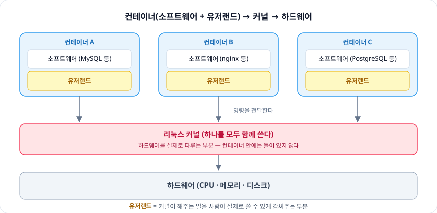
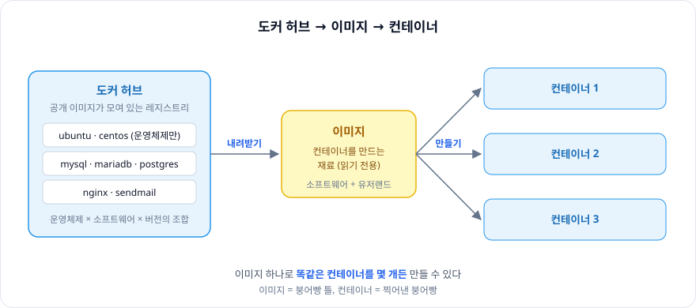
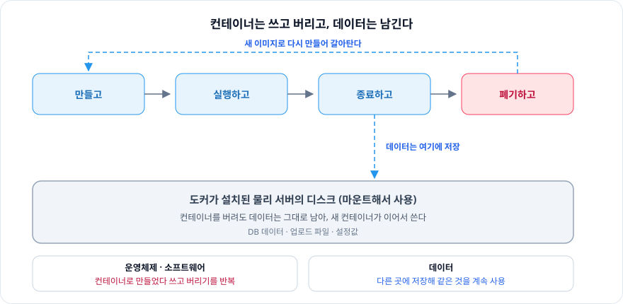

# 2장. 도커의 동작 원리

> 컨테이너에는 **커널이 없다.** 소프트웨어와 유저랜드만 담고, 커널은 호스트의 것을 함께 쓴다.
> 그래서 이미지는 가볍고, 컨테이너는 **쓰고 버릴 수 있는 일회용품**이 된다.

<br/>

## 도커의 동작 원리

```
컨테이너 (소프트웨어 + 유저랜드) → 커널 → 하드웨어
```

- **커널**: 하드웨어를 실제로 다루는 부분
- **유저랜드**: 커널이 해주는 일을 사람이 실제로 쓸 수 있게 감싸주는 부분

컨테이너 안에 들어가는 것은 **소프트웨어 + 유저랜드**까지다.
커널은 컨테이너마다 갖지 않고, 호스트의 커널 **하나를 모두 함께** 쓴다.



<br/>

## 도커 허브와 이미지, 그리고 컨테이너

### 이미지

- 컨테이너를 만드는 데 사용하는 **재료**
- 이미지 하나로 **똑같은 컨테이너를 몇 개든** 만들 수 있다

### 도커 허브

- **도커 레지스트리**(도커 이미지 배포 서비스)의 이름
- 공개된 컨테이너 이미지가 모여 있는 곳

도커 허브에 있는 이미지 종류

- **운영체제만** 들어 있는 이미지 (여러 버전)
- **소프트웨어가 포함된** 이미지 (MySQL, MariaDB, nginx, Sendmail, PostgreSQL)

→ 운영체제와 소프트웨어의 **조합**에 따라 다양한 이미지가 존재한다.



<br/>

## 도커 컨테이너는 쓰고 버리는 일회용품

컨테이너는 고쳐 쓰지 않는다.
오래된 컨테이너를 버리고, **새로운 이미지로부터 새 컨테이너를 만들어 갈아타는** 방식을 쓴다.

### 컨테이너의 생애주기

`만들고` → `실행하고` → `종료하고` → `폐기하고` → `만들고` → …

폐기할 때 데이터가 사라지지 않도록, 도커가 설치된 **물리 서버의 디스크를 마운트**해서 그 디스크에 데이터를 저장한다.

| 무엇 | 어떻게 다루나 |
|---|---|
| 운영체제 · 소프트웨어 | 컨테이너로 만들었다가 쓰고 버리는 것을 반복 |
| 데이터 | 다른 곳(마운트한 디스크)에 저장, 같은 것을 계속 사용 |



<br/>

## 도커의 성질

가장 핵심은 **환경을 격리할 수 있다**는 것이고, 나머지는 거기서 따라 나온다.

```
환경을 격리할 수 있다
  → 독립된 환경이 된다
  → 그 환경을 통째로 이미지로 만들 수 있다
  → 컨테이너에 커널을 포함시키지 않아도 된다
```

<br/>

## 도커의 장점과 단점

**장점**

- 한 대의 물리 서버에 여러 대의 서버를 띄울 수 있다
- 서버 관리가 용이하다
- 서버 고수가 아니어도 다루기 쉽다

**단점**

- **리눅스 운영체제**밖에 지원하지 않는다
- 호스트 서버에 문제가 생기면 **모든 컨테이너**에 영향을 끼친다

<br/>

## 도커의 용도

- **팀원 모두에게 동일한 개발환경 제공하기** (= 동일한 환경을 여러 개 만들기)
  - 프로젝트별로 컨테이너를 따로 사용할 수 있다
  - 컨테이너는 운영환경과 완전히 동일하게 생성 → **개발환경 = 운영환경**
- 새로운 버전의 **테스트**
- 동일한 서버가 **여러 대** 필요한 경우 (스케일링에 유리)

<br/>

## 💡 더 알아본 것 — 우분투 이미지 안에는 무엇이 들어 있나?

우분투 이미지는 몇십 MB밖에 되지 않는다. 우분투 설치 ISO가 몇 GB인 것과 비교하면 이상해 보인다.

이유는 **커널이 빠져 있기 때문**이다. 이미지에 담기는 것은 `/bin`, `/lib`, `/etc` 같은 **유저랜드**뿐이다.
`apt`, `bash`, `ls` 같은 명령어는 이미지 안에 들어 있지만, 그 명령들이 결국 호출하는 커널은 호스트의 것이다.

그래서 컨테이너 안에서 `uname -r`로 커널 버전을 보면 **호스트의 커널 버전**이 나온다.
컨테이너 안의 우분투 버전과 무관하다 — 1장에서 본 "커널은 모두 함께 쓴다"가 여기서 그대로 확인된다.
