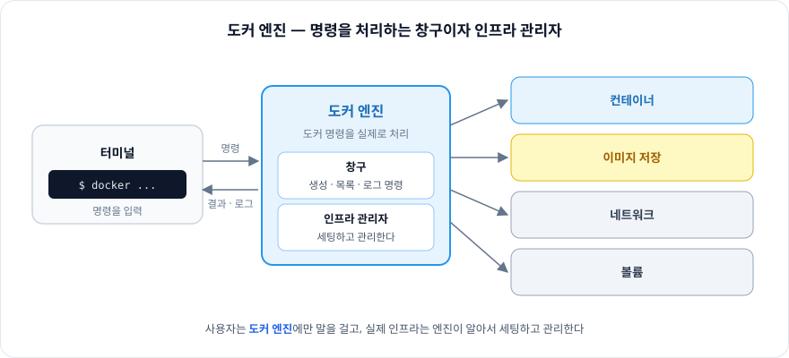
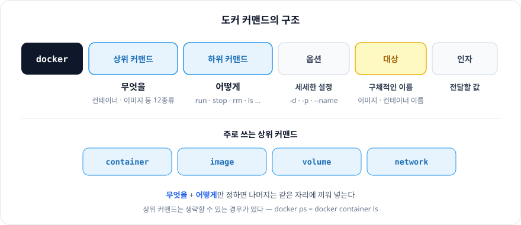
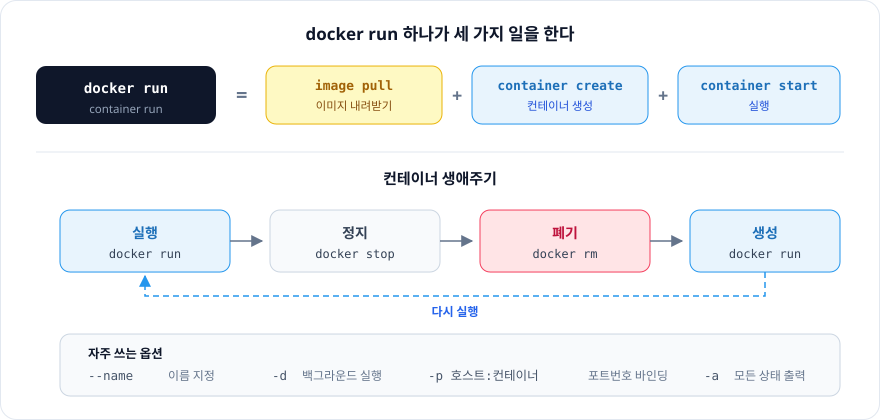
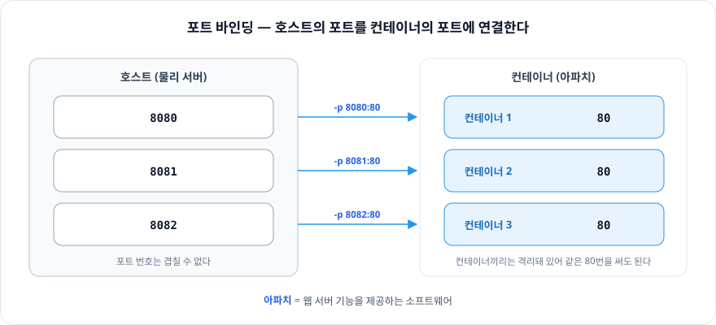

# 4장. 컨테이너를 실행해보자

> 도커 명령은 `docker (상위 커맨드) (하위 커맨드) (옵션) (대상) (인자)` 형식 하나로 통일돼 있다.
> 무엇을(상위) 어떻게(하위) 할지만 정하면, 컨테이너의 생성 · 실행 · 정지 · 폐기가 모두 같은 형식으로 굴러간다.

<br/>

## 도커 엔진 — 컨테이너를 만들고 다루는 창구, 인프라 관리자

- 도커 명령을 **실제로 처리**하는 주체
- 컨테이너를 만들거나, 목록을 보거나, 로그를 확인하는 명령을 **보내고 받는 창구** 역할
- 이미지 저장, 네트워크, 볼륨 같은 **인프라 세팅 · 관리**



<br/>

## 컨테이너의 기본적인 사용 방법

```
docker  (상위 커맨드)  (하위 커맨드)  (옵션)  (대상)  (인자)
```

| 구성 요소 | 의미 |
|---|---|
| **상위 커맨드** | **무엇을** — 컨테이너, 이미지 같이 12종류 |
| **하위 커맨드** | **어떻게** |
| 옵션 | 커맨드에 세세한 설정을 지정하는 용도 |
| **대상** | 구체적인 이름 지정 |
| 인자 | 대상에 전달할 값을 지정 |

주로 쓰는 형태

```
docker  (container / image / volume / network)  (하위 커맨드)  (옵션)
```



<br/>

## 컨테이너의 생성과 삭제, 실행, 정지

컨테이너 생애주기

`실행` → `정지` → `폐기` → `생성` → `실행` → …

> `docker run`, `docker stop`, `docker rm`

### 생성

```
docker [container] run
```

`run` 하나가 세 가지 일을 한다.

```
docker [container] run  =  docker [image] pull
                         + docker [container] create
                         + docker [container] start
```

| 옵션 | 의미 |
|---|---|
| `--name` | 컨테이너 이름 지정 |
| `-d` | 백그라운드 실행 |
| `-p (호스트포트번호):(컨테이너포트번호)` | 포트번호 바인딩 |

### 정지

```
docker [container] stop
```

### 삭제

```
docker [container] rm
```

### 컨테이너 목록 출력

```
docker ps        = docker container ls
```

- `-a` 옵션: **모든 상태**의 컨테이너 출력



<br/>

## 컨테이너의 통신

**아파치**: 웹 서버 기능을 제공하는 소프트웨어

호스트 (8080, 8081, 8082) — 컨테이너 (80)

→ 실습: 통신이 가능한 컨테이너 생성



<br/>

## 컨테이너 생성에 익숙해지기

| 분류 | 이미지 |
|---|---|
| 리눅스 운영체제가 담긴 컨테이너 | `ubuntu` `centos` `debian` `fedora` `busybox` `alpine` |
| 웹서버 / 데이터베이스 서버용 컨테이너 | `httpd` `nginx` `mysql` `postgres` `mariadb` |
| 런타임, 그 외 소프트웨어 | `openjdk` `python` `php` `ruby` `perl` `gcc` `node` `registry` `wordpress` `nextcloud` `redmine` |

`-dit` = `-d` + `-i` + `-t`

→ 백그라운드에서 실행하면서, 키보드를 통해 컨테이너 내부의 파일 시스템을 조작

<br/>

## 이미지 삭제

```
docker image rm     # 이미지 삭제
docker image ls     # 이미지 목록
```
