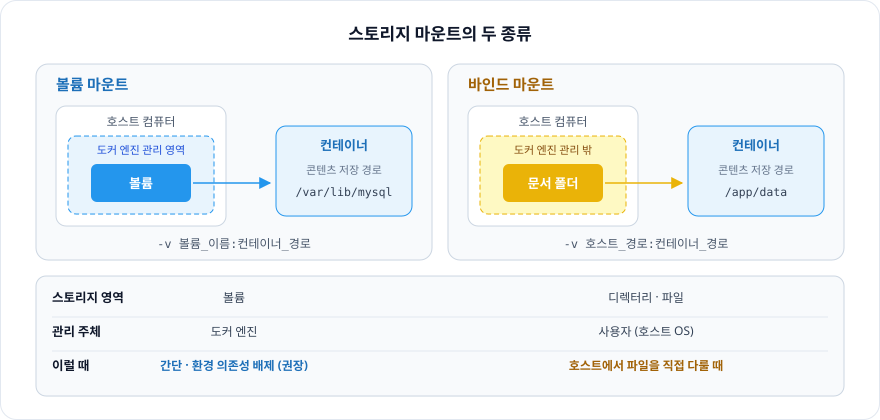
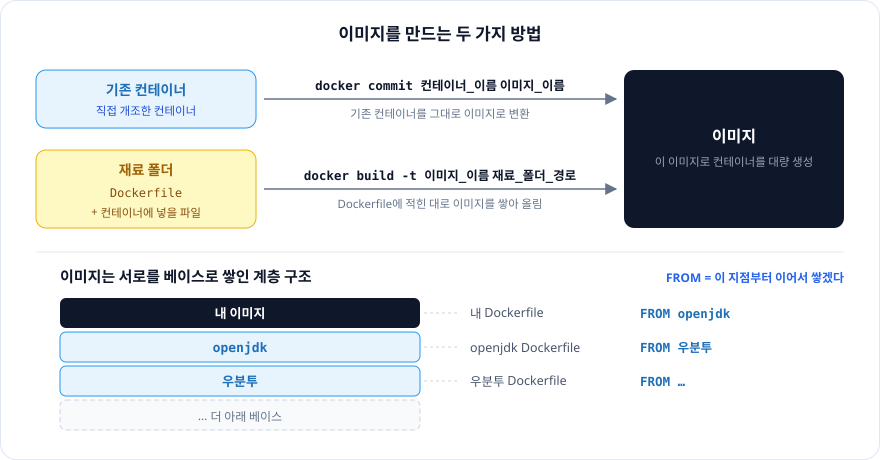
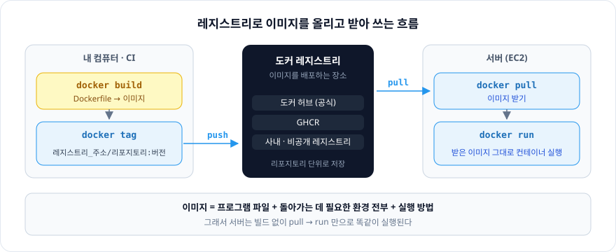

# 6장. 실전에 활용 가능한 컨테이너 사용법을 익히자

> 컨테이너는 버리고 새로 만드는 것이라, 남길 데이터는 **마운트**로 밖에 두고, 다시 쓸 환경은 **이미지**로 만들어 **레지스트리**에 올린다.
> 그러면 어느 서버든 `pull` → `run`만으로 똑같은 컨테이너를 띄울 수 있다.

※ 6장 5개 절 중 **볼륨 마운트(6-3) · 컨테이너를 이미지로 만들기(6-4) · 도커 허브 로그인(6-6)** 만 정리했다. (6-2 파일 복사, 6-5 컨테이너 개조는 제외)

<br/>

## 볼륨 마운트 — 데이터를 컨테이너 밖에 두기

| 용어 | 의미 |
|---|---|
| **볼륨** | 스토리지의 한 영역을 분할한 것 |
| **마운트** | 대상을 연결해 운영체제 · 소프트웨어의 관리 하에 두는 일 |
| **데이터 퍼시스턴시** | 매번 데이터를 옮기는 대신, 처음부터 **컨테이너 외부에 둔 데이터**에 접근해 사용하는 것 |

### 스토리지 마운트의 두 종류

| 종류 | 스토리지 영역 | 설명 |
|---|---|---|
| **볼륨 마운트** | 볼륨 | **도커 엔진이 관리하는 영역** 안에 만든 볼륨을 컨테이너에 디스크 형태로 마운트 |
| **바인드 마운트** | 디렉터리 · 파일 | 문서 폴더, 바탕화면 폴더처럼 **도커 엔진이 관리하지 않는 영역**의 기존 디렉터리를 컨테이너에 마운트 |



### 무엇을 쓸까 — 3가지 차이점 포인트

- 간단한지, 복잡한지
- 호스트 컴퓨터에서 파일을 다룰 필요가 있는지
- 환경의 의존성을 배제해야 하는지

**볼륨**은 간단하고 환경 의존성을 배제할 수 있다 → **도커 제작사의 권장** 방식. 대신

- 직접 볼륨에 접근할 방법이 없다
- 억지로 볼륨을 수정하려고 하면 볼륨 자체가 깨진다
- 백업에도 복잡한 절차가 필요하다

→ 호스트 컴퓨터에서 파일을 직접 다뤄야 한다면 **바인드 마운트**

### 마운트 지정 방법

> 어느 방식이든 스토리지 마운트는 `run` 커맨드의 **옵션** 형태로 지정한다.

두 위치를 **경로 형태**로 지정한다.

- **마운트 원본** — 스토리지 영역의 위치 (볼륨 이름 / 호스트 경로)
- **마운트 대상** — 컨테이너 안의 위치 (= 컨테이너의 소프트웨어가 콘텐츠를 저장하는 경로)

```
docker run -v 마운트_원본:마운트_대상 ...
```

### 스토리지를 마운트하는 절차

1. **스토리지 영역 생성**
   - 바인드 마운트: 폴더나 파일 만들기
   - 볼륨 마운트: `docker volume create 볼륨_이름`
2. **컨테이너 생성 + 마운트**

<br/>

## 컨테이너를 이미지로 만들기

- 컨테이너로 **이미지를 만들고**
- 그 이미지로 **대량의 컨테이너를 만든다**

### 방법 1. `commit` — 기존 컨테이너를 이미지로 변환

```
docker commit 컨테이너_이름 새로운_이미지_이름
```

### 방법 2. `Dockerfile` — 스크립트로 이미지 만들기

**Dockerfile**: 애플리케이션을 도커 이미지로 만드는 파일

- 토대가 될 이미지, 실행할 명령어를 기재한다
- 호스트 컴퓨터의, 이미지 재료가 들어 있는 폴더에 넣는다

`재료 폴더 (Dockerfile + 컨테이너에 넣을 각종 파일)` → `build` → `이미지`

```
docker build -t 생성할_이미지_이름 재료_폴더_경로
```

| 명령어 | 의미 |
|---|---|
| `FROM` | 베이스 이미지 지정 |
| `WORKDIR` | 이후 명령어들이 실행될 작업 디렉터리 설정 |
| `COPY` | 로컬 파일을 이미지 안으로 복사 |
| `RUN` | 이미지 **빌드 시점**에 실행되는 명령어 |
| `ENV` | 환경변수 설정 |
| `ARG` | **빌드 시에만** 쓰는 변수 |
| `EXPOSE` | 컨테이너가 사용할 포트를 문서화 |
| `VOLUME` | 컨테이너 밖에 데이터를 유지할 마운트 포인트 지정 |
| `CMD` | 컨테이너 **실행 시** 기본 실행 명령 |
| `ENTRYPOINT` | 컨테이너 **고정** 실행 명령 |

### 이미지는 계층 구조 — `FROM`의 의미

이미지는 한 덩어리가 아니라, **서로를 베이스로 쌓여 있는** 계층 구조다.
`FROM`은 그 체인에서 **"나는 이 지점부터 이어서 쌓겠다"** 고 지정하는 것.

```
내 Dockerfile       FROM openjdk
openjdk Dockerfile  FROM 우분투
우분투 Dockerfile    FROM …
```



<br/>

## 도커 허브 로그인 — 이미지를 올리고 받아 쓰기

직접 만든 이미지로 `docker run` 해서 컨테이너를 만들려면, **이미지를 가져올 수 있는 장소**가 필요하다.
직접 만든 이미지도 도커 허브에 올릴 수 있고, 비공개로 쓰는 도커 허브 같은 장소를 따로 만들 수도 있다.

| 용어 | 의미 |
|---|---|
| **도커 레지스트리** | 이미지를 배포하는 장소 (도커 허브, 사내 레지스트리, 개인 레지스트리 …) |
| **도커 허브** | 도커 제작사에서 운영하는 **공식** 도커 레지스트리 |
| **리포지토리** | 레지스트리를 구성하는 단위. 도커 허브에서는 리포지토리가 각각 ID를 갖는다 |
| **태그** | 레지스트리 업로드를 상정한 이미지 이름 |

태그 형식

```
레지스트리_주소/리포지토리_이름:버전
```

### 명령어

```
docker login                                                      # 레지스트리 로그인
docker tag 원래_이미지_이름 레지스트리_주소/리포지토리_이름:버전      # 태그를 부여해 복제
docker push 레지스트리_주소/리포지토리_이름:버전                     # 이미지 업로드
```

### 실제 흐름

1. `docker build`로 이미지 만들기
2. `docker push`로 도커 허브에 올리기
3. EC2에서 `docker pull`로 이미지 받기
4. `docker run`으로 컨테이너 만들기

**이미지 = 프로그램 파일 + 프로그램이 돌아가는 데 필요한 환경 전부 + 어떻게 실행할지에 대한 명령어**

→ 그래서 서버는 소스코드도 빌드도 필요 없이, 받은 이미지를 실행만 하면 된다.



### 내 예시 — 해커톤 프로젝트 배포 (GHCR)

도커 허브 대신, 같은 역할을 하는 **GHCR(GitHub Container Registry)** 을 썼다.

1. GitHub Actions가 `backend/Dockerfile`로 이미지를 **빌드**
2. 이미지를 GHCR에 **push** (`:latest` + 커밋 해시 태그 2개)
3. EC2에는 소스코드도 Dockerfile도 올리지 않는다. `docker-compose.prod.yml` **파일 하나만** scp로 복사
4. EC2에서 `docker login ghcr.io` → `docker compose -f docker-compose.prod.yml pull backend`로 이미지를 받고 → `up -d`로 실행

- **"CI에서 빌드 한 번, 서버는 pull만"** 구조 — EC2는 빌드를 전혀 하지 않는다
- `GITHUB_TOKEN`으로 로그인하고 `packages: read` 권한을 명시 → 공개 이미지가 아니라 **접근이 제한된 사설 이미지**
  - `mysql` 같은 공개 이미지와 달리, 프로젝트 코드가 담긴 이미지는 그 팀만 pull할 수 있다
