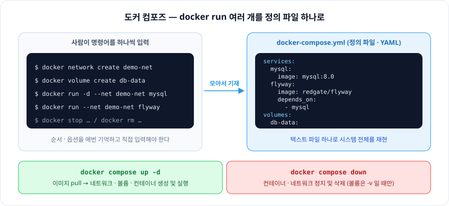
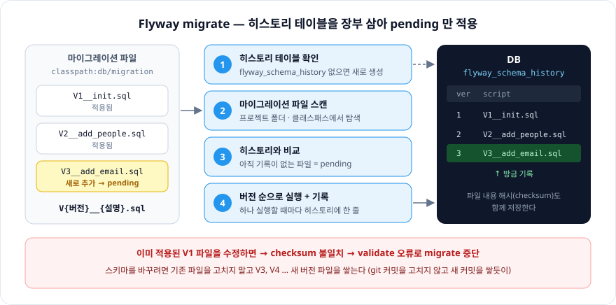

# 7장. 도커 컴포즈를 익히자

> 사람이 `docker run`을 하나씩 입력하던 일을 **정의 파일 하나**에 적어 두면, 도커 컴포즈가 대신 입력해준다.
> `up` 한 번에 시스템 전체가 뜨고, `down` 한 번에 정리된다.

※ 컴포즈를 쓰는 김에 **Flyway(DB 마이그레이션 툴)** 를 컴포즈로 띄워보는 실습까지 함께 정리했다. (책 범위 밖) → [실습 폴더](./flyway-docker-demo)

<br/>

## 도커 컴포즈란

**도커 컴포즈**: 시스템 구축에 필요한 명령어를 **텍스트 파일(정의 파일)** 하나에 기재해, 명령어 한 번에 시스템 전체를 **실행 · 종료 · 폐기**까지 할 수 있게 도와주는 도구

| 구분 | 무엇을 위한 파일인가 |
|---|---|
| **도커 컴포즈** (`docker-compose.yml`) | `docker run` 명령어 여러 개를 모아놓은 것 → 컨테이너 · 네트워크 · 볼륨 **생성** |
| **Dockerfile** | **이미지**를 만들기 위한 스크립트 |

- 정의 파일 이름은 `docker-compose.yml`, 형식은 **YAML**
- 정의 파일은 **한 폴더에 하나**만 둔다
  - 다른 이름을 쓰려면 `-f`로 지정한다 (6장 해커톤 예시의 `docker compose -f docker-compose.prod.yml up -d`)
- 컴포즈에서는 컨테이너 집합체를 **서비스**라고 부른다

| 커맨드 | 하는 일 |
|---|---|
| `up` | 정의 파일 내용대로 이미지를 내려받고, 컨테이너를 생성 및 실행. 네트워크 · 볼륨도 함께 만든다 |
| `down` | 컨테이너와 네트워크를 정지 및 삭제 |



<br/>

## `docker-compose.yml` 작성법

작성 순서: **주 항목 → 이름 추가 → 설정**

```yaml
services:            # 주 항목
  mysql:             # 이름 (뒤에 콜론)
    image: mysql:8.0 # 설정 — 값이 하나면 콜론 뒤에 이어 적기
    ports:           # 설정 — 값이 여러 개면 하이픈 + 들여쓰기
      - "3306:3306"
```

### 작성 요령

1. 첫 줄에 도커 컴포즈 버전을 기재 (`version: "3"`)
   - ⚠️ 책 기준 규칙. 지금의 Compose v2에서는 `version`을 쓰지 않는다 (적으면 obsolete 경고만 나오고 무시됨). 실습 파일도 `services:`로 바로 시작한다
2. 주 항목 아래에 설정 내용을 기재
3. 항목 간의 상하 관계는 **공백을 사용한 들여쓰기**로 나타낸다
4. 들여쓰기는 **같은 수의 배수**만큼의 공백을 사용 (처음에 공백 2개로 들여썼다면 이후에도 2개가 한 단)
   - **탭은 쓸 수 없다.** YAML은 공백에 따라 의미가 달라진다
5. 이름은 주 항목 아래에 들여쓰기한 다음 기재
6. 컨테이너 설정 내용은 이름 아래에 들여쓰기한 다음 기재
7. 여러 항목을 기재할 때는 줄 앞에 `-`를 붙인다
8. 이름 뒤에는 `:`
9. `:` 뒤에는 반드시 **공백**
10. `#`은 주석
11. 문자열은 작은따옴표 `'` 또는 큰따옴표 `"`로 감싸 작성

### 주 항목

| 주 항목 | 의미 |
|---|---|
| `services` | 컨테이너 정의 |
| `networks` | 네트워크 정의 |
| `volumes` | 볼륨 정의 |

### 자주 쓰는 정의 내용

| 항목 | 의미 | 대응하는 `docker run` 옵션 |
|---|---|---|
| `image` | 사용할 이미지 | `이미지_이름` |
| `networks` | 참여할 네트워크 | `--net` |
| `volumes` | 스토리지 마운트 | `-v` |
| `ports` | 포트 바인딩 | `-p` |
| `environment` | 환경변수 | `-e` |
| `depends_on` | 다른 서비스에 대한 **의존 관계** (먼저 띄울 서비스) | 없음 |
| `restart` | 컨테이너가 종료됐을 때 **재시작 여부** | `--restart` |

> **`depends_on`은 "먼저 시작"까지만 보장한다.** DB 컨테이너가 시작됐다고 해서 접속을 받을 준비가 된 건 아니다.
> 준비 완료까지 기다리게 하려면 `healthcheck` + `condition: service_healthy`를 함께 쓴다. (아래 실습에서 사용)

<br/>

## 도커 컴포즈 실행

```
docker compose up -d     # 백그라운드로 기동 (DB만 띄워둘 때 자주 씀)
docker compose down      # 컨테이너 · 네트워크 정지 및 삭제
docker compose down -v   # 볼륨까지 삭제 (DB 데이터 초기화)
```

- `down`은 **볼륨을 지우지 않는다.** 데이터까지 날리려면 `-v`
- 받아둔 **이미지도 남는다**

### 컨테이너의 실제 이름은 정의 파일에 적은 이름과 다르다

컴포즈가 만든 컨테이너 이름은 `프로젝트명(폴더명)-서비스명-번호` 형태가 된다. 네트워크도 `폴더명_default`로 자동 생성된다.

실습에서 실제로 확인한 이름:

| 정의 파일에 적은 것 | 실제로 만들어진 것 |
|---|---|
| (네트워크 정의 없음) | `flyway-docker-demo_default` |
| 서비스 `flyway` (`run`으로 실행) | `flyway-docker-demo-flyway-run-c2bb8fe37191` |
| 서비스 `mysql` + `container_name: flyway-demo-mysql` | `flyway-demo-mysql` ← `container_name`을 주면 그 이름을 쓴다 |

<br/>

## 실습 — Flyway를 컴포즈로 띄우기

### 마이그레이션이란

**데이터베이스의 구조나 데이터 자체를 변경하는 과정**

- **데이터 이전**: 하나의 데이터베이스 시스템에서 다른 시스템으로 데이터를 옮기는 작업
- **스키마 변경**: 테이블, 인덱스 등 데이터베이스 구조를 추가 · 수정 · 삭제
- **버전 관리 및 이력 추적**: 마이그레이션 툴로 DB 변경 사항을 버전 관리하고 변경 내역을 추적

**데이터 마이그레이션 툴 (DB 형상관리 툴)**: DB 변경 사항을 추적하고, 업데이트나 롤백을 쉽게 할 수 있도록 도와주는 도구. Flyway가 대표적이다.

### Flyway 기본 동작

1. **히스토리 테이블 확인** — DB 안에 `flyway_schema_history` 테이블이 있는지 찾는다. 빈 DB라면 직접 만든다 (어떤 마이그레이션이 적용됐는지 기록하는 **장부**)
2. **마이그레이션 스캔** — 프로젝트 폴더, 클래스패스를 뒤져 마이그레이션 파일을 찾는다
3. **버전 순서대로 적용** — 아직 적용되지 않은 **pending migrations**를 버전 번호 기준으로 정렬해 하나씩 실행하고, 실행할 때마다 히스토리 테이블에 "이 버전까지 적용 완료"를 기록한다

개발하다 스키마가 바뀌면 → **새 마이그레이션 파일을 추가** → 다음 실행 때 pending으로 잡혀 적용된다.
DDL이든 DML이든, 뭔가 바꾸고 싶으면 새 파일 하나 추가하면 끝.



### 파일 이름 규칙

```
{접두어}{버전}__{설명}.sql      예) V1__Create_person_table.sql
```

| 부분 | 규칙 |
|---|---|
| 접두어 | `V` = 한 번만 적용 (Versioned) / `R` = 내용이 바뀌면 매번 재적용 (Repeatable, 버전 없이 `R__설명.sql`) |
| 버전 | `1`, `1.1`, `2`처럼 숫자. 이 숫자 순서대로 실행 |
| 구분자 | 버전과 설명 사이는 **언더스코어 두 개** `__` |

### 체크섬 — 적용된 파일은 고치지 않는다

Flyway는 마이그레이션 파일의 **내용 해시(checksum)** 를 히스토리 테이블에 저장한다.
나중에 V1 파일을 열어 수정하면 체크섬이 안 맞는다고 **오류를 낸다.**

→ 스키마를 바꾸고 싶으면 기존 파일을 고치는 게 아니라 **V2, V3처럼 새 버전 파일을 계속 추가**한다.
(git에서 이미 올린 커밋을 수정하지 않고 새 커밋을 쌓는 것과 같다)

### 실습 구성

```
flyway-docker-demo/
├── docker-compose.yml
└── sql/
    ├── V1__Create_person_table.sql   # PERSON 테이블 생성 (DDL)
    └── V2__Add_people.sql            # 데이터 3건 추가 (DML)
```

```yaml
services:
  mysql:
    image: mysql:8.0
    container_name: flyway-demo-mysql
    environment:
      MYSQL_ROOT_PASSWORD: rootpass
      MYSQL_DATABASE: demo_db
    ports:
      - "3306:3306"
    healthcheck:                      # 접속 가능한지 5초마다 확인
      test: ["CMD", "mysqladmin", "ping", "-h", "localhost", "-uroot", "-prootpass"]
      interval: 5s
      retries: 10

  flyway:
    image: redgate/flyway
    depends_on:
      mysql:
        condition: service_healthy    # mysql이 healthy가 된 뒤에 실행
    volumes:
      - ./sql:/flyway/sql             # 바인드 마운트로 마이그레이션 파일 전달
    environment:
      FLYWAY_URL: jdbc:mysql://mysql:3306/demo_db?allowPublicKeyRetrieval=true&useSSL=false
      FLYWAY_USER: root
      FLYWAY_PASSWORD: rootpass
    command: migrate
```

(요약본. 전체는 [docker-compose.yml](./flyway-docker-demo/docker-compose.yml))

- `FLYWAY_URL`의 호스트가 `localhost`가 아니라 **서비스 이름 `mysql`** — 같은 컴포즈 네트워크 안에서는 서비스 이름으로 서로 찾는다
- 6장에서 배운 **바인드 마운트**로 호스트의 `sql/` 폴더를 컨테이너에 넘긴다

### 실행 결과

**① 첫 실행** — 히스토리 테이블을 만들고 V1, V2를 순서대로 적용

```
$ docker compose up -d mysql
$ docker compose run --rm flyway

Schema history table `demo_db`.`flyway_schema_history` does not exist yet
Successfully validated 2 migrations
Creating Schema History table `demo_db`.`flyway_schema_history` ...
Current version of schema `demo_db`: << Empty Schema >>
Migrating schema `demo_db` to version "1 - Create person table"
Migrating schema `demo_db` to version "2 - Add people"
Successfully applied 2 migrations to schema `demo_db`, now at version v2
```

`flyway_schema_history`에 남은 기록

```
installed_rank  version  description          script                        checksum    success
1               1        Create person table  V1__Create_person_table.sql   1715188512  1
2               2        Add people           V2__Add_people.sql            476766047   1
```

**② 다시 실행** — pending이 없으니 아무것도 하지 않는다

```
Current version of schema `demo_db`: 2
Schema `demo_db` is up to date. No migration necessary.
```

**③ 적용된 V1 파일을 수정한 뒤 실행** — 체크섬 불일치로 중단

```
ERROR: Validate failed: Migrations have failed validation
Migration checksum mismatch for migration version 1
-> Applied to database : 1715188512
-> Resolved locally    : -890299591
Either revert the changes to the migration, or run repair to update the schema history.
```

**④ 정리**

```
$ docker compose down -v
```

<br/>

## Spring Boot 프로젝트에 적용할 때

### 마이그레이션 폴더 구조 — 스키마와 샘플 데이터를 분리

```
src/
└── main/
    └── resources/
        └── db/
            ├── migration/
            │   ├── V0__init.sql    # 초기 테이블 생성
            │   └── ...             # 스키마 추가 및 수정
            └── seed/
                ├── local/
                │   └── ...         # 샘플 데이터 추가 및 수정
                └── dev/
                    └── ...         # 샘플 데이터 추가 및 수정
```

테이블 생성을 위한 `migration`과, 환경별 샘플 데이터인 `seed`를 분리한다.

### application.yml

```yaml
spring:
  flyway:
    enabled: true
    baseline-on-migrate: true
    baseline-version: 0
    locations:
      - classpath:db/migration
      - classpath:db/seed
```

| 설정 | 의미 |
|---|---|
| `enabled` | 애플리케이션 시작 시 Flyway 마이그레이션 실행 |
| `locations` | 마이그레이션 파일을 찾을 위치 |
| `baseline-on-migrate` | 히스토리 테이블이 없는 **기존 DB(비어 있지 않은 스키마)** 에 처음 적용할 때, 현재 상태를 기준점(baseline)으로 삼는다 |
| `baseline-version` | 기준점으로 삼을 버전. **이 버전 이하의 파일은 적용하지 않고 건너뛴다** |

> **적용하면서 알게 된 주의점**
>
> - **baseline은 비어 있지 않은 DB에서만 동작한다.** 빈 DB라면 baseline 없이 `V0__init.sql`부터 정상 실행된다.
>   반대로 테이블이 이미 있는 DB에 처음 붙이면 `V0`은 baseline(0) 이하라 건너뛴다 → 기존 테이블을 "이미 V0까지 적용된 상태"로 간주하는 것
> - **`locations`는 하위 폴더까지 전부 스캔한다.** `classpath:db/seed`로 지정하면 `seed/local`과 `seed/dev`가 모두 적용된다.
>   환경별로 나누려면 프로필별 설정(`application-local.yml`)에서 `classpath:db/seed/local`처럼 지정한다
> - **버전 번호는 모든 location을 통틀어 겹치면 안 된다.** `migration/V1__…`과 `seed/local/V1__…`이 함께 있으면 충돌한다
